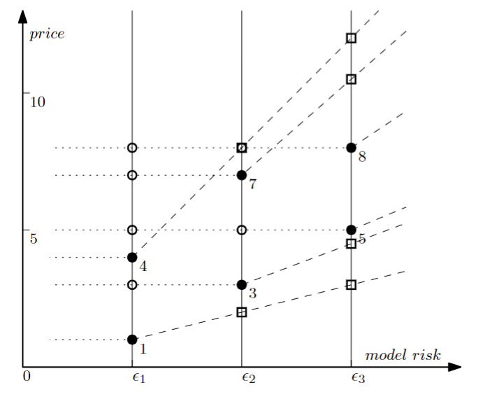

# Dealer: 基于差分隐私的端到端模型市场

## 摘要

数据驱动的机器学习已经无处不在。机器学习模型市场连接了数据拥有者和模型购买者，能够极大地促进数据驱动的机器学习应用。本文从正式的数据市场角度出发，提出了第一个基于差分隐私的**端到端模型市场（Dealer）**，旨在回答以下问题：如何制定数据拥有者的补偿函数和模型购买者的价格函数？代理商如何确定一组模型的价格以最大化收入并保证无套利，以及如何在给定制造预算的情况下训练一组具有最大 Shapley 覆盖率的模型以保持竞争力？

对于前者，我们基于 Shapley 值和隐私敏感性为每个数据拥有者提出补偿函数，基于 Shapley 覆盖敏感性和噪声敏感性为每个模型购买者提出价格函数。隐私敏感性和噪声敏感性都通过差分隐私水平来衡量。对于后者，我们制定了模型定价和模型训练的两个优化问题，并提出了高效的动态规划算法。在真实国际象棋数据集和合成数据集上的实验结果证明了 Dealer 的设计合理性，并验证了所提算法的效率和有效性。

## 1. 引言

机器学习在各种类型的任务中取得了巨大成功，并被应用于越来越多的行业和企业中。高可用性的机器学习模型依赖于大量高质量的训练数据，这使得数据具有价值变得显而易见。最近的研究和实践以各种方式接近数据的商品化。数据市场以直接或间接（衍生）形式销售数据。这些数据市场可以根据它们销售的内容及其相应的定价机制进行大致分类：1）（原始）基于数据的定价，2）基于查询的定价，以及 3）基于模型的定价。

### 1.1 现有数据市场的局限性

**基于数据定价的数据市场**销售数据集并允许购买者直接访问数据，例如 Dawex、Twitter、Bloomberg、Iota 和 SafeGraph。数据拥有者对其数据使用的控制有限或没有控制，这使得市场难以激励更多数据拥有者贡献或导致缺乏透明度的市场。此外，当购买者只对从数据集中提取的特定信息感兴趣时，购买整个数据集可能过于昂贵。

**基于查询定价的数据市场**，例如 Google Bigquery，通过按查询收费和按查询补偿数据拥有者来部分缓解这些缺点。市场对数据使用限制（例如，返回具有隐私保护的查询）、补偿分配和基于查询的定价做出决策。然而，这些市场考虑的大多数查询过于简单，无法支持复杂的数据分析和决策制定。

**基于模型定价的数据市场**最近被提出。文献[14]专注于根据模型质量对一组模型实例进行定价以最大化收入，而文献[23]考虑当数据用于 k 近邻（k-NN）模型时如何在数据拥有者之间公平分配补偿。值得注意的是，他们专注于市场的数据拥有者端或模型购买者端，但不是两者兼顾。最近，文献[8]从相对更完整的角度处理它，并提出了代理商从模型购买者设置模型使用费用以及向数据拥有者分配补偿的策略。

### 1.2 研究挑战

尽管已经努力确保代理商遵循重要的市场设计原则，但模型市场应该如何响应数据拥有者和模型购买者的需求仍然研究不足。因此，我们想问：**如何构建一个端到端的市场，专门用于机器学习模型，能够同时满足所有三个实体（即数据拥有者、代理商和模型购买者）的需求？**

我们从每个实体的角度总结差距和挑战如下：

- **数据拥有者**：在现有的数据市场解决方案中，数据拥有者接受代理商分配的数据使用补偿。他们在向代理商提供数据时没有设置隐私偏好的方法。要解决的挑战是：如何基于代理商分配的收入公平分享以及数据拥有者对隐私保护的要求来制定数据拥有者的补偿函数？

- **模型购买者**：与销售数字商品的几个版本的相同做法一样，现有工作提供了一套具有不同质量水平的模型进行销售。然而，他们过于简化的基于噪声注入的版本控制通过噪声的大小量化模型质量，这与模型购买者对模型实用性的需求不直接一致。挑战是：如何基于对模型噪声的抵抗以及用于构建模型的数据价值所捕获的模型相对实用性来制定模型购买者的价格函数？

- **代理商**：在制定市场决策时，代理商应考虑数据拥有者的补偿函数和模型购买者的价格函数。挑战是：代理商如何确定一组模型的价格以最大化收入并保证无套利，以及如何在给定制造预算的情况下训练一组具有最大实用性的模型以保持竞争力？


_图 1：基于模型定价的端到端数据市场。完整流程请参见算法 8。_

### 1.3 贡献

在本文中，我们通过提出基于差分隐私的**端到端模型市场（Dealer）**来弥合上述差距并解决已识别的挑战。

图 1 提供了一个示例，包括三个实体（即数据拥有者、代理商和模型购买者）及其简化的交互。从数据拥有者的角度来看，Dealer 提出了数据拥有者的隐私敏感性来建模他们对隐私保护的要求，并使用 Shapley 值来建模收入的公平分享。每个数据拥有者都有基于隐私敏感性和 Shapley 值的独特补偿函数。从模型购买者的角度来看，Dealer 提出了模型购买者的 Shapley 覆盖敏感性和噪声敏感性来建模他们对 Shapley 覆盖的需求和对模型噪声的抵抗。每个模型购买者都有基于 Shapley 覆盖敏感性和噪声敏感性的独特价格函数。数据拥有者的隐私敏感性和模型购买者的噪声敏感性都通过差分隐私水平统一衡量。

从代理商的角度来看，Dealer 通过两个重要功能描述了完整的市场动态：1）模型定价，旨在最大化收入，同时遵循无套利的市场设计原则，防止模型购买者通过将以较低价格出售的低层模型组合成高层模型来利用市场，以逃避该层的指定价格；2）模型训练，旨在在给定每个模型版本的制造预算的情况下最大化 Shapley 覆盖以保持竞争力。

我们为模型定价和模型训练设计了高效的算法。我们在本文中的目标不是为基于差分隐私的模型市场中涉及的众多问题提供完整的解决方案，而是引入一个框架来研究许多问题并可能开辟新的研究方向。我们简要总结我们的贡献如下：

- 我们提出了基于差分隐私的端到端模型市场 Dealer，这是第一个包括所有市场参与者的系统性研究。Dealer 形式化了三个实体的能力和限制，为数据拥有者制定补偿函数，为模型购买者制定价格函数，并通过制定两个优化问题提出代理商采取的市场决策：用于模型定价的收入最大化问题（带有无套利约束）和用于模型训练的 Shapley 覆盖最大化问题。

- 对于模型定价的收入最大化问题，我们展示了其复杂性，将搜索空间离散化，并提出了高效的动态规划算法。对于模型训练的 Shapley 覆盖最大化问题，我们展示了其复杂性，并提出了具有近似保证的高效动态规划、贪心和基于猜测的贪心算法。

- 在真实国际象棋数据集和合成数据集上进行了实验，验证了 Dealer 中模型定价和模型训练所提算法的效率和有效性。

### 1.4 组织结构

本文其余部分组织如下。第 2 节介绍相关工作。第 3 节提供预备知识，包括 Shapley 值及其计算、版本控制、无套利定义和差分隐私相关定义和性质的概念。我们在第 4 节中提供基于差分隐私的端到端模型市场。第 5 节中介绍了 Dealer 中优化问题的高效算法。我们在第 6 节中报告实验结果和发现。最后，第 7 节得出结论并讨论未来工作。

## 2. 相关工作

在本节中，我们讨论数据市场的补偿分配和定价机制的相关工作。更详细的调查，请参见文献[33]。

### 2.1 补偿分配

在数据市场中，补偿分配的常见方式是基于数据拥有者贡献的数据的重要性。评估数据点对模型重要性的一种默认方法是留一法（LOO），它比较在有和没有该数据点的完整数据集上训练的预测器的性能差异。然而，LOO 不满足我们期望的数据评估的性质（平衡性、对称性、零元素和可加性）。例如，给定数据集中的一个点$p$，如果数据集中有一个完全相同的副本$p'$，从这个数据集中移除$p$不会改变预测器，因为$p'$仍然在那里。因此，LOO 将为$p$分配零值，无论$p$有多重要，这违反了对称性质。

Shapley 值是合作博弈论中的一个概念，以 Lloyd Shapley 的名字命名。与 LOO 相比，Shapley 值满足几个理想的性质，包括平衡性、对称性、零元素和可加性。结合其支持不同效用函数的灵活性，Shapley 值被广泛应用于数据定价领域，以评估数据的重要性。应用 Shapley 值的一个主要挑战是其计算复杂性过高。已经开发了许多近似方法来克服精确 Shapley 值的计算困难。最具代表性的方法是蒙特卡洛方法，它基于排列的随机采样。

在本文中，我们允许数据拥有者设置个性化的补偿函数，相应的补偿不仅依赖于 Shapley 值，还基于隐私敏感性。

### 2.2 定价机制

**无嫉妒的基于查询的定价**：Ghosh 等人首次使用差分隐私发起了私有数据市场的研究。他们建模了第一个框架，其中数据购买者希望购买敏感信息来估计人口统计量。他们第一次定义了一个名为无嫉妒的性质。无嫉妒确保没有个人愿意与他人交换他们的付款和隐私成本。

**无套利的基于查询的定价**：Li 等人提出了第一个理论框架，用于将价值分配给嘈杂查询答案作为其准确性的函数，并用于在应得补偿其隐私损失的数据拥有者之间分配收入。他们定义了无嫉妒的增强版本，称为无套利。无套利定价确保数据购买者不能通过组合两个低价查询以较低价格购买所需信息。

**无套利的基于模型的定价**：由于基于机器学习的分析的日益普及，对研究获取机器学习数据成本的兴趣日益浓厚。Chen 等人提出了第一个也是唯一现有的基于模型的定价框架，它直接为具有不同噪声的机器学习模型实例定价，而不是为数据定价。他们制定了一个优化问题来找到最大化代理商收入的无套利价格，并证明了这种优化问题是 coNP-hard 的。

然而，他们的工作存在几个限制：1）他们的工作只关注代理商和模型购买者之间的交互，因为数据拥有者的市场研究功能可以完全由代理商替代；2）他们假设每个模型只有一个（平均）调查价格点，这过于简化；3）他们没有对其提出的高斯机制进行明确的隐私分析和保证，该机制向模型添加噪声。

## 3. 预备知识

在本节中，我们介绍后续发展的预备知识，并在表 1 中总结常用符号以方便读者。

### 表 1：符号总结

| 符号                    | 定义              |
| ----------------------- | ----------------- |
| $D_i$                   | 第$i$个数据拥有者 |
| $B_j$                   | 第$j$个模型购买者 |
| $M_k$                   | 第$k$个模型       |
| $U$                     | 效用函数          |
| $SV$                    | Shapley 值        |
| $z_i$                   | 第$i$个数据集     |
| $\epsilon$              | DP 参数           |
| $\rho_i$                | $D_i$的隐私敏感性 |
| $\sigma_j$              | $B_j$的效用敏感性 |
| $\gamma_j$              | $B_j$的噪声敏感性 |
| $CR$                    | 覆盖率函数        |
| $MB$                    | 制造预算          |
| $(\epsilon_k, sp_k[j])$ | 调查价格点        |
| $(\epsilon_k, p_k[j])$  | 完整价格点        |

### 3.1 公平性和 Shapley 值

考虑$n$个数据拥有者$D_1, \ldots, D_n$，使得数据拥有者$D_i$拥有数据集$z_i$（$1 \leq i \leq n$）。我们假设一个效用函数$U(S)$（$S \subseteq \{z_1, \ldots, z_n\}$），它评估由多个数据拥有者的数据集组成的联盟$S$对于任务（如训练机器学习模型）的效用。Shapley 制定了市场公平性的基本要求，包括平衡性、对称性、零元素和可加性。具体来说，Shapley 值是一种度量，可以用来评估数据重要性，用于分配补偿，同时满足所有要求。Shapley 值衡量来自数据拥有者$D_i$的$z_i$在所有可能的数据拥有者联盟中平均贡献的边际效用改进。

$$SV_i = \frac{1}{n} \sum_{S \subseteq \{z_1,\ldots,z_n\}\backslash z_i} \frac{U(S \cup \{z_i\}) - U(S)}{\binom{n-1}{|S|}}$$

计算精确的 Shapley 值必须枚举所有子集，因此计算成本过高。我们采用常用的蒙特卡洛模拟方法来计算近似 Shapley 值。我们首先从不同数据拥有者的数据集中采样随机排列，然后从第一个数据集到最后一个数据集扫描每个排列，并计算每个新数据集的边际贡献。通过检查足够数量的排列，Shapley 值的最终估计就是所有计算出的边际贡献的平均值。这种蒙特卡洛模拟给出了 Shapley 值的无偏估计，给定足够数量的排列。

在实际应用中，我们可以迭代地进行蒙特卡洛模拟，直到平均值经验收敛，如算法 1 所示，其中$\tau$是排列数量。$\tau$的值越大，计算出的 Shapley 值往往越准确。

**算法 1：蒙特卡洛 Shapley 值计算**

**算法：Shapley 值计算**

**输入：** 数据集 $z_1, \ldots, z_n$

**输出：** 每个数据集 $z_i$ 的 Shapley 值 $SV_i$ $(1 \leq i \leq n)$，以及 $\tau > 0$

1. 初始化 $SV_i = 0$ $(1 \leq i \leq n)$

2. **for** $k = 1$ **to** $\tau$ **do**

3. $\quad$ **let** $\pi^k$ be a random permutation of $\{1, \ldots, n\}$

4. $\quad$ **for** $i = 1$ **to** $n$ **do**

5. $\quad\quad SV(z_{\pi^k(i)}) = U(\{z_{\pi^k(1)}, \ldots, z_{\pi^k(i)}\}) - U(\{z_{\pi^k(1)}, \ldots, z_{\pi^k(i-1)}\})$

6. $\quad\quad SV_{\pi^k(i)} += SV(z_{\pi^k(i)})$

7. **return** $SV_1, \ldots, SV_n$

基于定义和 Shapley 值的公平补偿性质，我们可以轻松地将一个数据拥有者的一个数据集的 Shapley 值推广到多个拥有者的数据集联盟的 Shapley 值。

**推论 3.1**：设$S_D \subseteq \{D_1, \ldots, D_n\}$是数据拥有者的子集。那么，
$$SV(S_D) = \sum_{i:D_i \in S_D} SV_i$$
是一个 Shapley 值，可用于满足公平性所有要求的数据拥有者子集的补偿分配。

### 3.2 版本控制

在一个理想的世界中，代理商拥有无限资源，代理商可以以个性化价格向每个模型购买者销售个性化模型以最大化收入。然而，这种个性化定价在实际应用中很少可能。有一种实用且经常采用的方式，即提供少量不同版本的产品，这些产品旨在吸引不同类型的购买者。在这种策略下，称为版本控制，购买者会自我分割。购买者选择的版本揭示了购买者对数据集的价值以及购买者愿意支付的价格。遵循这种行业惯例，在我们的模型市场中，代理商训练$l$个不同的模型版本，具有不同的模型隐私参数，这些参数通过差分隐私来衡量。

### 3.3 无套利定价

当市场中有多个版本可用时，可能从一个或多个总成本较低的版本中派生出更昂贵的版本。在这种情况下，套利就会出现。套利使代理商和购买者之间的交互复杂化。购买者必须仔细选择版本以实现最低价格，而代理商可能无法最大化发布价格所期望的收入。因此，无套利定价函数是非常理想的。如果定价函数满足以下两个性质，则该定价函数是无套利的。它防止模型购买者通过将以较低价格出售的低层版本组合成高层版本来利用市场，以逃避该层的指定价格。

**性质 1（单调性）**：给定函数$f : (\mathbb{R}^+)^n \rightarrow \mathbb{R}^+$，当且仅当对于任意两个向量$\mathbf{x}, \mathbf{y} \in (\mathbb{R}^+)^n$，$\mathbf{x} \leq \mathbf{y}$，有$f(\mathbf{x}) \leq f(\mathbf{y})$时，$f$是单调的。

**性质 2（次可加性）**：给定函数$f : (\mathbb{R}^+)^n \rightarrow \mathbb{R}^+$，当且仅当对于任意两个向量$\mathbf{x}, \mathbf{y} \in (\mathbb{R}^+)^n$，有$f(\mathbf{x} + \mathbf{y}) \leq f(\mathbf{x}) + f(\mathbf{y})$时，$f$是次可加的。

### 3.4 差分隐私

差分隐私是一个严格提供隐私保护的正式数学框架。据我们所知，现有的模型市场都没有采用或考虑差分隐私。

**定义 3.2（差分隐私）**：如果对于任何一对在一个数据样本上不同的数据集$S$和$S'$，以及$\mathcal{A}$的所有可能输出$OUT$，随机化算法$\mathcal{A}$是$(\epsilon, \delta)$-差分隐私的，满足以下条件：

$$P[\mathcal{A}(S) \in OUT] \leq e^\epsilon P[\mathcal{A}(S') \in OUT] + \delta$$

其中概率取决于$\mathcal{A}$的随机性。

简而言之，这个公式意味着差分隐私算法的输出在两个相差一个样本的数据集之间是无法区分的。$\epsilon$捕获了无法区分的程度，直觉上可以看作是每个数据样本隐私损失的上界。$\epsilon$越小，输出越无法区分，隐私损失越少。另一个参数$\delta$捕获隐私损失超出上界的概率。给定指定的$\epsilon$，$\delta$越接近 0，隐私泄露的概率越小，算法越好。在实践中，为了有意义的 DP 保证，参数选择为$0 < \epsilon \leq 10, \delta \ll \frac{1}{n}$，其中$n$是数据拥有者的数量。

在本文中，代理商将训练一组具有差分隐私保证的模型。根据差分隐私后处理的鲁棒性，模型购买者对模型的任何后处理都不会产生额外的隐私损失。为了简单起见，我们使用统一的小值$\delta$和不同版本模型的不同$\epsilon$。

**引理 3.3（简单组合）**：考虑有$J$个随机化算法，每个算法对于$j \in \{1, \ldots, J\}$都是$(\epsilon_j, \delta_j)$-差分隐私的，那么顺序应用这$J$个算法满足$(\sum_{j=1}^J \epsilon_j, \sum_{j=1}^J \delta_j)$-差分隐私。

引理 3.3 对于 DP 机制设计和分析至关重要，它使算法设计者能够将基本 DP 操作组合成更复杂的操作。重要的是，我们稍后将展示它在模型市场设计中也起着关键作用。引理 3.3 表明差分隐私是版本控制模型与无套利定价的适当机制。挑战是如何确保版本化模型的定价是无套利的。

为了训练满足差分隐私的模型，一种流行的方法是目标扰动，它通过量化噪声扰动目标函数。对于扰动目标，我们采用基于梯度下降的迭代优化算法来获得近似解，这在实际机器学习模型训练中很流行。然而，如文献[22]中指出的，传统的目标扰动为扰动目标函数的精确最优值建立 DP 保证，而近似解的 DP 保证是未知的。

为了允许代理商利用实际的迭代训练算法并仍然实现差分隐私，在本文中，我们遵循称为近似最小值扰动的增强目标扰动，它允许将扰动目标解决到$\alpha$近似。它使用两阶段噪声注入策略，既扰动目标又扰动近似输出。

**算法 2：差分隐私模型训练的目标扰动**

**算法：差分隐私学习**

**输入：** $Z_{\text{train}}$ 和 $(\varepsilon, \delta)$

**输出：** $w_{\text{DP}}$

1. 采样 $N_1 \sim \mathcal{N}(0_d, \sigma_1^2 I_d)$，其中 $\sigma_1 = \frac{20L^2\log(1/\delta)}{\varepsilon^2}$ 且 $L$ 是 $L_2$-Lipschitz 常数

2. 目标扰动: $L_{\text{OP}}(w) = L(w; Z_{\text{train}}) + \lambda\|w\|_2^2 + \frac{1}{n}\langle N_1, w \rangle$

3. 优化 $L_{\text{OP}}(w)$ 以获得 $\alpha$ 近似解 $\hat{w}$

4. 采样 $N_2 \sim \mathcal{N}(0_d, \sigma_2^2 I_d)$，其中 $\sigma_2 = \frac{40\alpha\log(1/\delta)}{\lambda\varepsilon^2}$

5. **return** $w_{\text{DP}} = \text{proj}_\Omega(\hat{w} + N_2)$

算法的思想总结在算法 2 中。特别地，第 2 行用校准噪声$N_1$扰动模型，第 3 行优化扰动模型，然后在第 4 行用噪声$N_2$进行输出扰动。最后，通过投影到约束集$\Omega$获得$w_{DP}$。如下一个引理所示，算法 2 基于训练数据集$Z_{train}$训练$(\epsilon, \delta)$-DP 模型，输出模型参数$w_{DP}$。

**引理 3.4**：算法 2 是$(\epsilon, \delta)$-差分隐私的。

在 Dealer 中，代理商将通过调用算法 2 来训练一系列差分隐私模型。

## 4. DEALER：结构和参与方

在本节中，我们提出模型市场 Dealer。我们描述 Dealer 的结构，包括参与方及其在市场中的操作。我们首先给出 Dealer 的概述，然后详细说明角色和机制。

### 4.1 概述

Dealer 的目标是连接来自数据拥有者的供应和来自模型购买者的需求。我们假设一个代理商从多个数据拥有者收集数据，设计和构建模型，并将模型销售给多个模型购买者。数据拥有者、代理商和模型购买者有不同的关注点和要求。

**数据拥有者**有两个关注点。首先，他们关注隐私保护。构建的模型中隐私保护越少，数据拥有者要求的补偿就越多。此外，数据拥有者期望基于从销售给模型购买者的模型收入的公平分享。在 Dealer 中，我们提出数据拥有者的隐私敏感性来建模他们对隐私保护的要求，并使用 Shapley 值来建模收入的公平分享。

**模型购买者**关注模型的效用或准确性，这通过用于构建模型的数据的 Shapley 值覆盖率和为实现隐私保护而添加的噪声来捕获。更多的数据覆盖率和更少的添加噪声，模型对购买者的价值就越高。在 Dealer 中，我们提出模型购买者的 Shapley 覆盖敏感性和噪声敏感性，分别建模他们对 Shapley 覆盖的需求和对噪声的抵抗。为了捕获经济约束，我们假设每个模型购买者都有预算。代理商可以相应地计算给定模型的 Shapley 覆盖率，这通过用于训练模型的选定数据的 Shapley 值来捕获。我们假设模型购买者总是购买满足其需求的最便宜模型。

**代理商**使用从数据拥有者收集的数据定义和构建模型，并将模型销售给模型购买者。在不失一般性的情况下，我们假设代理商是中立的，不收取模型构建成本，即模型销售的总收入完全和公平地分配给数据拥有者。为了实践 Dealer，代理商可以轻松地将总收入的一定百分比用于模型构建和其他成本，这不会影响我们的机制。代理商的目标是最大化总收入。

为了保持我们讨论的简单性，我们假设 Dealer 中的所有参与方，包括数据拥有者、代理商和模型购买者，都是诚实的。也就是说，市场中不存在欺骗活动。我们还假设代理商是可信的，即它可以访问数据拥有者的原始数据。未来的工作可以考虑代理商不可信的设置，通过结合本地差分隐私和联邦学习等技术。

### 4.2 数据拥有者

我们假设$n$个数据拥有者$D_1, \ldots, D_n$。为了清晰起见，我们重载符号$D_i$（$1 \leq i \leq n$）来表示$D_i$拥有的数据。每个数据拥有者$D_i$（$1 \leq i \leq n$）愿意与代理商分享她的数据以获得补偿。所请求的补偿取决于数据拥有者通过代理商销售的模型披露的隐私。此外，$D_i$期望基于贡献数据的效用与其他数据拥有者公平分享收入。

在本文中，我们使用$\epsilon$-差分隐私来量化可能的用户隐私披露。从技术上讲，我们对数据拥有者$D_i$使用单调补偿函数$c_i$来建模数据拥有者对使用数据$D_i$并满足$\epsilon$-差分隐私的模型的请求补偿。

$$c_i(\epsilon) = b_i \cdot s_i(\epsilon) \tag{3}$$

其中$\epsilon \geq 0$是差分隐私参数，$b_i$是基础价格，应该与$D_i$相对于其他对等贡献者贡献的所有数据集$\{D_1, \ldots, D_n\}$用于构建模型的 Shapley 值成比例。函数$s_i(\epsilon)$反映用户在价格上的隐私信念。$\epsilon$的值越大，$\epsilon$-差分隐私提供的保护越少，因此请求的补偿越高。通常，任何关于$\epsilon$的单调函数都可以使用。注意差分隐私定义中的因子$e^\epsilon$控制隐私披露的容忍度。$e^\epsilon$的值越大，隐私保护越少。在本文中，我们在讨论中使用以下$s_i(\epsilon)$函数。

$$s_i(\epsilon) = (e^\epsilon)^{\rho_i} = e^{\rho_i \cdot \epsilon} \tag{4}$$

参数$\rho_i \geq 0$调整用户价格弹性对隐私的边际增长，称为用户的隐私敏感性。当$0 \leq \rho_i < 1$时，$s_i(\epsilon)$相对于$e^\epsilon$次线性增长；当$\rho_i > 1$时，增长是超线性的；当$\rho_i = 1$时，增长与$e^\epsilon$相同。非常注重隐私的数据拥有者可以有超线性函数，这意味着如果使用她的数据，补偿更高，但可能不会被选择用于模型构建，因为代理商的制造预算有限。

值得注意的是，在我们当前的公式中，$b_i$基于$D_i$的 Shapley 值，该值是基于没有任何扰动的模型计算的（对应于$\epsilon = \infty$）。我们可以证明 Shapley 值的四个公理对于一般$\epsilon$值的$c_i(\epsilon)$仍然成立。或者，可以为每个用不同$\epsilon$-DP 训练的模型计算 Shapley 值。然而，这将显著增加计算成本。此外，不能保证数据拥有者牺牲的隐私越多，她得到的补偿越多，因为代理商无法控制隐私风险和补偿之间的关系。

### 4.3 模型购买者

我们假设$m$个模型购买者$B_1, \ldots, B_m$，分别携带预算$V_1, \ldots, V_m$，其中$V_j > 0$（$1 \leq j \leq m$）。根据模型准确性对模型定价是直观的。然而，这种公式不适合我们旨在实现的无套利约束。在本文中，我们使用用于构建模型的数据的 Shapley 值覆盖率和为隐私保护添加到模型中的噪声来衡量模型的相对效用。这使我们能够在理论上实现无套利约束，同时基于数据拥有者的相对边际贡献（与绝对准确性相比）提供实用且可转移的效用度量。我们注意到更多数据（更高 Shapley 值）和更少噪声通常不保证但确实导致更高的准确性，正如我们稍后在实验中将展示的那样。

首先，购买者的报价对用于构建模型的数据价值的覆盖率敏感。理想的模型使用来自所有数据拥有者$D_1 \ldots D_n$的所有数据集。模型购买者可能对应该用于构建模型的数据 Shapley 值的百分比设定期望要求，购买者愿意支付的价格可能会相应改变。我们强调，当使用不同的数据子集构建模型时，不仅数据的数量，而且数据的价值或它们对模型的贡献对模型的最终准确性都很重要。因此，我们将覆盖率定义为 Shapley 值的比率来衡量相对效用，而不是子集大小的比率。

正式地，对于使用来自其数据拥有者的$k$个数据集$D_{i_1}, \ldots, D_{i_k}$构建的模型$M$，模型$M$的覆盖率是

$$CR(M) = CR(D_{i_1}, \ldots, D_{i_k}) = \frac{SV(\{D_{i_1}, \ldots, D_{i_k}\})}{SV(\{D_1, \ldots, D_n\})} \tag{5}$$

从技术上讲，模型购买者$B_j$（$1 \leq j \leq m$）可以设定覆盖期望$\theta_j$（$0 < \theta_j \leq 1$）。$B_j$愿意为相对于覆盖率$CR(M)$的模型$M$支付的价格可以是

$$Price_{coverage}(B_j) = V_j \cdot \frac{1}{1 + e^{-\delta_j(CR(M)-\theta_j)}} \tag{6}$$

其中参数$\delta_j > 0$是$B_j$的覆盖敏感性，它控制如果模型不满足 Shapley 覆盖期望$\theta_j$，购买者对模型失去兴趣的速度。$\delta_j$的值越大，在期望点$\theta_j$处价格变化越剧烈。

其次，购买者的报价对添加到模型中的噪声也敏感。理想的模型不添加任何噪声。为隐私保护添加的噪声的影响可以通过$\epsilon$-差分隐私机制中的参数$\epsilon$定量衡量。在$\epsilon$-差分隐私中，当$\epsilon = \infty$时不添加噪声。从技术上讲，模型购买者$B_j$（$1 \leq j \leq m$）可以设定噪声期望$\eta_j$（$\eta_j > 0$）和参数$\gamma_j$（$\gamma_j > 0$），称为噪声敏感性，以表达购买者对噪声的价格敏感性：$\gamma_j$的值越大，购买者对噪声越敏感。

将上述两个方面结合起来，对于购买者$B_j$（$1 \leq j \leq m$），设$V_j$是购买者购买模型的总预算，$\theta_j$是 Shapley 值中 Shapley 覆盖的期望，$\delta_j$是 Shapley 覆盖敏感性，$\eta_j$是差分隐私中模型噪声的期望，$\gamma_j$是噪声敏感性。那么，对于使用来自数据拥有者的数据集$D_{i_1}, \ldots, D_{i_k}$构建并满足$\epsilon$-差分隐私的模型$M$，我们对模型购买者$B_j$在模型$M$上使用以下价格函数

$$P(B_j, M) = V_j \cdot \frac{1}{1 + e^{-\delta_j(CR(M)-\theta_j)}} \cdot \frac{1}{1 + e^{-\gamma_j(\epsilon-\eta_j)}} \tag{7}$$

显然，$P(B_j, M)$反映了模型购买者$B_j$对模型$M$的价值评估，因此也被称为$M$对$B_j$的模型价值。

### 4.4 代理商

代理商从数据拥有者收集数据，构建模型并销售给模型购买者。为了适应不同数据拥有者对隐私保护的要求和各种模型购买者对 Shapley 覆盖和噪声敏感性的需求，可能会开发模型的多个版本。在实践中，向模型购买者提供的版本数量通常保持较小。我们也将模型的一个版本简单地称为模型。

假设代理商构建$l$个模型版本，$M_1, \ldots, M_l$。模型$M_k$（$1 \leq k \leq l$）被指定为元组$M_k = (\mu_k, \epsilon_k, p_k)$，其中$\mu_k = CR(M_k)$是模型的覆盖率，$\epsilon_k$是差分隐私保证的水平，$p_k$是代理商设定的价格。为了使市场简洁，我们按$\mu$值和$\epsilon$值升序列出模型，即如果$k_1 \leq k_2$，则$\mu_{k_1} \leq \mu_{k_2}$和$\epsilon_{k_1} \leq \epsilon_{k_2}$。设$r(M_k, D_i)$是分配给为模型$M_k$贡献数据的数据拥有者$D_i$的补偿。补偿由代理商决定。

在模型市场 Dealer 中，我们对参与者的行为做出以下假设。

- **（参与）**：数据拥有者$D_i$只要代理商能够分配不少于数据拥有者要求的付款，即$r(M_k, D_i) \geq c_i(\epsilon_k)$，就向模型$M_k$贡献数据。数据拥有者参与并从满足要求的每个模型中收取补偿。

- **（公平性）**：对于任何模型$M_k$和向模型贡献数据的数据拥有者$D_{i_1}$和$D_{i_2}$，
  $$\frac{r(M_k, D_{i_1})}{c_{i_1}(\epsilon_k)} = \frac{r(M_k, D_{i_2})}{c_{i_2}(\epsilon_k)}$$

即，所有贡献数据拥有者在每个模型内的补偿是公平的。

- **（成本最小化购买）**：模型购买者$B_j$只要存在模型$M_k$使得
  $$
  \theta_j \leq \mu_k \text{ and } \eta_j \leq \epsilon_k \tag{8}
  $$
  ，就购买一个且仅一个模型

如果没有模型$M_k$满足等式 8，那么$B_j$什么都不购买；如果只有一个模型$M_k$满足等式 8，那么$B_j$以预算$P(B_j, M_k)$购买$M_k$；如果有多个模型$M_{k_1}, \ldots, M_{k_{l'}}$满足等式 8，那么$B_j$购买具有$\arg\min_{k \in \{k_1,\ldots,k_{l'}\}} \epsilon_k$的模型，即具有最低$\epsilon$和最低价格的模型，预算为$P(B_j, M_{\arg\min_{k \in \{k_1,\ldots,k_{l'}\}} \epsilon_k})$。

- **（中立代理商）**：对于使用数据集$D_{i_1}, \ldots, D_{i_{n'}}$并被模型购买者$B_{j_1}, \ldots, B_{j_{m'}}$购买的每个模型$M_k$，$\sum_{i \in \{i_1,\ldots,i_{n'}\}} r(M_k, D_i) = m' \cdot p_k$，即每个模型产生的收入完全分配给所有数据贡献者。在本文中，我们假设中立代理商以保持我们的讨论简单。在实践中，代理商可以轻松地将总收入的一定百分比用于模型构建和其他成本，这不会影响我们的机制和算法。

代理商负责定义模型的版本。理想情况下，无套利保证可能应用于$\mu_k$和$\epsilon_k$两者。然而，在现有工作中，无套利保证只应用于一个变量。由于$\epsilon_k$对模型准确性的影响比$\mu_k$大得多（图 6），在本文中，代理商确保关于$\epsilon_k$的无套利保证。现在我们准备陈述 Dealer 中的优化问题。

给定一组数据拥有者、一组模型购买者和模型数量$l$，代理商需要定义$l$个模型$M_1, \ldots, M_l$，使得总收入$\sum_{k=1}^l p_k \cdot purchase(p_k)$最大化，其中$purchase(p_k)$是购买$M_k$的模型购买者数量。在本文的其余部分，我们将此问题称为收入最大化问题。

## 5. DEALER：模型定价和模型训练

在本节中，我们研究第 5.1 节中模型定价的收入最大化问题。给定来自模型购买者的最大化收入，代理商需要最大化每个模型版本的 Shapley 覆盖以保持竞争力，并查看 Shapley 覆盖是否满足预定义的 Shapley 覆盖。我们在第 5.2 节中研究模型训练的 Shapley 覆盖最大化问题。我们还在第 5.3 节中总结了完整的 Dealer 动态。

### 5.1 模型定价的收入最大化问题

在发布模型和设定销售价格之前，代理商需要进行市场调查，收集每个模型购买者的价格函数$P(B_j, M_k)$以便为模型定价以最大化收入，这可以由代理商本身或第三方公司完成。设调查规模为$m'$，即招募$m'$个潜在模型购买者提供他们的价格函数$P(B_j, M_k)$。给定代理商计划训练的一组模型，具有覆盖率$\mu_k$和 DP 参数$\epsilon_k$，对于第$j$个调查参与者$B_j$，代理商根据等式 8 计算$(tm_j, v_j)$，如果至少有一个模型满足$B_j$在 Shapley 覆盖和模型噪声方面的要求，其中$tm_j$表示$B_j$的目标模型，$v_j$是购买者购买$tm_j$的预算。我们在以下内容中将每个$(tm_j, v_j)$称为调查价格点。

通过从调查购买者计算出的$m'$个元组，代理商将在最大化收入的目标下为每个模型定价，同时遵循无套利定价的市场设计原则。收入最大化（RM）问题制定如下。

$$\arg\max_{\langle p(\epsilon_1),\ldots,p(\epsilon_l) \rangle} \sum_{k=1}^l \sum_{j=1}^{m'} p(\epsilon_k) \cdot I(tm_j == M_k) \cdot I(p(\epsilon_k) \leq v_j) \tag{9}$$

$$s.t. \quad p(\epsilon_{k_1} + \epsilon_{k_2}) \leq p(\epsilon_{k_1}) + p(\epsilon_{k_2}), \quad \epsilon_{k_1}, \epsilon_{k_2} > 0 \tag{10}$$

$$0 < p(\epsilon_{k_1}) \leq p(\epsilon_{k_2}), \quad 0 < \epsilon_{k_1} \leq \epsilon_{k_2} \tag{11}$$

其中$I(tm_j == M_k)$表示$B_j$的目标模型是否为$M_k$，$I(p(\epsilon_k) \leq v_j)$表示具有 DP 参数$\epsilon_k$的模型$M_k$的价格（从 DP 参数角度的$p_k$或$p(\epsilon_k)$）是否小于或等于$B_j$购买$M_k$的预算。这个收入最大化问题的最优解具有无套利保证，因为等式 10 确保次可加性（性质 2），等式 11 确保单调性（性质 1）。我们注意到我们的问题公式不假设所有模型购买者都能负担目标模型或所有模型都有购买者。考虑这种额外约束是有趣的未来工作。

我们将 RM 的最大收入称为$MAX(RM)$，并使用$(\epsilon_k, sp_k[j])$来表示模型$M_k$中具有 DP 参数$\epsilon_k$的第$j$个最低调查价格点。例如，我们假设图 2 中$\epsilon_1 = 1, \epsilon_2 = 2, \epsilon_3 = 3$。我们有六个调查点（参与者），黑色圆盘显示$(1, sp_1[1] = 1), (1, sp_1[2] = 4), (2, sp_2[1] = 3), (2, sp_2[2] = 7), (3, sp_3[1] = 5), (3, sp_3[2] = 8)$，其中$(2, sp_2[1] = 3)$意味着一个模型购买者希望使用预算 3 购买具有 DP 参数$\epsilon_2$的模型$M_2$。这些调查价格点构成调查价格空间。

RM 问题的一个特殊情况已经在文献[14]中研究过，给定每个模型一个（平均）调查价格点。给定每个模型$M_k$（$k = 1, \ldots, l$）的一个调查价格点$(\epsilon_k, sp_k[1])$，确定是否存在定价函数$p(\epsilon_k)$，该函数 1）是正的、单调的和次可加的；2）确保对于所有$k = 1, \ldots, l$，$p(\epsilon_k) = sp_k[1]$，已被证明是 co-NP 难问题。很容易看出这个 co-NP 难问题是 RM 问题的特殊情况，该问题对每个模型有多个调查价格点。

为了克服原始优化 RM 问题的困难，我们通过放松次可加性约束来寻求近似解决问题。我们将等式 10 中的$p(\epsilon_{k_1} + \epsilon_{k_2}) \leq p(\epsilon_{k_1}) + p(\epsilon_{k_2})$约束放松为

$$\frac{p(\epsilon_{k_1})}{\epsilon_{k_1}} \geq \frac{p(\epsilon_{k_2})}{\epsilon_{k_2}}, \quad \epsilon_{k_1} \leq \epsilon_{k_2} \tag{12}$$

这仍然满足无套利定价的要求，因为这个新约束对于次可加性约束是充分但非必要的。我们将这个放松问题称为放松收入最大化（RRM）问题。直觉上，我们希望确保大宗购买的单价小于或等于小宗购买的单价。

在以下内容中，我们展示 RRM 的最大收入$MAX(RRM)$相对于 RM 的最大收入$MAX(RM)$有一个下界。

**定理 5.1**：RM 的最大收入与 RRM 的最大收入有以下关系，
$$MAX(RRM) \geq MAX(RM)/2$$

**动态规划算法**：我们展示了一个高效的动态规划算法来解决放松收入最大化问题。


_图 2：收入最大化示例_

乍一看，对于每个模型，似乎价格范围内的所有可能值都可能是最优价格，这使得问题可以说是难以处理的。在以下内容中，我们展示如何在离散空间中构造完整价格空间，并证明完整价格空间足以获得最大收入。

**构造完整价格空间**：很容易看出那些调查价格点可能是潜在解决方案。对于每个调查价格点$(\epsilon_k, sp_k[j])$，它确定单价$sp_k[j]/\epsilon_k$和价格$sp_k[j]$。一般思想是，如果我们在模型$M_k$中选择$(\epsilon_k, sp_k[j])$作为最优价格点，它会由于单调性约束影响模型$M_{k'}$（$k' = 1, \ldots, k-1$）的价格，由于次可加性约束影响模型$M_{k'}$（$k' = k+1, \ldots, l$）的单价。如果我们将模型$M_k$中的最优价格设为$sp_k[j]$，模型$M_k$之后的后续模型的单价不能大于$sp_k[j]/\epsilon_k$。因此，对于每个调查价格点$(\epsilon_k, sp_k[j])$，我们通过调查价格点$(\epsilon_k, sp_k[j])$和原点画一条线$l_{(\epsilon_k,sp_k[j])}$。对于具有 DP 参数$\epsilon_{k'}$的每个模型$M_{k'}$，我们通过$(\epsilon_{k'}, 0)$画一条垂直线$l_{\epsilon_{k'}}$。通过相交线$l_{(\epsilon_k,sp_k[j])}$和线$l_{\epsilon_{k'}}$，我们为$k' = k+1, \ldots, l$获得$l-k$个新价格点$(\epsilon_{k'}, \frac{sp_k[j]}{\epsilon_k}\epsilon_{k'})$。我们注意到我们不需要为$k' = 1, \ldots, k-1$生成价格点作为候选，因为模型$M_k$的单价只能约束模型$M_{k'}$（$k' = k+1, \ldots, l$）的单价（由于次可加性约束）。

此外，对于每个模型，其价格也由其右邻居的调查价格点确定（由于单调性约束）。因此，我们需要将模型$M_k$的调查价格点添加到模型$M_{k'}$（$k' = 1, \ldots, k-1$）。构造完整价格空间的详细算法如算法 3 所示。

**算法 3：为放松收入最大化问题构造完整价格空间**

```
输入：具有噪声参数 εₖ 和模型中噪声参数 εₖ 的第 j 个最低调查价格点，记为 (εₖ, spₖ[j])
输出：完整价格空间
1 将所有调查价格点 (εₖ, spₖ[j]) 添加到完整价格空间;
2 for each 调查价格点 (εₖ, spₖ[j]) do
3   画线 l_{(εₖ,spₖ[j])} 通过此点和原点;
4   for each 模型噪声参数 εₖ do
5     画垂直线 lₑₖ;
6     for each 线 lₑₖ' do
7       for each 线 l_{(εₖ,spₖ[j])} do
8         通过相交线 lₑₖ' 和线 l_{(εₖ,spₖ[j])} 添加点 (εₖ', spₖ[j]/εₖ εₖ')
           到完整价格空间，对于 k' = k+1, ..., l;
9 for each 调查价格点 (εₖ, spₖ[j]) do
10   为 k' = 1, ..., k-1 添加价格点 (εₖ', spₖ[j]) 到完整价格空间;
11 for each 完整价格空间中的价格点 (εₖ, pₖ[j]) do
12   if (εₖ, pₖ[j']) 是调查价格点 then
13     f(εₖ, pₖ[j]) = 1;
14   else
15     f(εₖ, pₖ[j]) = 0;
```

在第 11-15 行中，我们使用$f(\epsilon_k, p_k[j])$来区分调查价格点和完整价格空间中的其他点。为了便于表示，我们将第 1 行的完整价格空间中的价格点命名为 SU（调查）点，第 8 行的价格点命名为 SC（次可加性约束）点，第 10 行的价格点命名为 MC（单调性约束）点。

**示例 5.2**：我们展示算法 3 的运行示例。在图 2 中，我们在第 1 行将调查价格点$(1, sp_1[1] = 1), (1, sp_1[2] = 4), (2, sp_2[1] = 3), (2, sp_2[2] = 7), (3, sp_3[1] = 5), (3, sp_3[2] = 8)$添加到完整价格空间。在第 2 行中，对于调查价格点$(1, 1)$，我们在第 3 行中通过此点和原点画线$l_{(1,1)}$。在第 4 行中，对于具有隐私参数$\epsilon_1 = 1$的模型$M_1$，我们画垂直线$l_{\epsilon_1}$。在第 6-8 行中，对于$l_{(1,1)}$和$l_{\epsilon_2}$，我们将交点$(\epsilon_2, \frac{sp_1[1]}{\epsilon_1}\epsilon_2) = (2, 2)$添加到完整价格空间。总共，我们有六个这样的新价格点，显示在方框中。在第 9 行中，对于调查价格点$(3, sp_3[1]) = (3, 5)$，我们在第 10 行中将价格点$(2, 5)$和$(1, 5)$添加到完整价格空间。类似地，我们还有六个这样的新价格点，显示在圆圈中。因此，对于完整价格空间，我们有模型$M_1$和$M_3$的六个价格点。我们有模型$M_2$的五个价格点，因为交点$(\epsilon_2, \frac{sp_1[2]}{\epsilon_1}\epsilon_2) = (2, 8)$与$k = 2$的 MC 点$(\epsilon_k, sp_3[2]) = (2, 8)$相同。在第 12-15 行中，我们有$f(2, 3) = 1$和$f(2, 5) = 0$。

**定理 5.3**：算法 3 构造的完整价格空间足以找到放松收入最大化问题的最优解。

**递归解决方案**：我们根据子问题的最优解递归地定义最优解的收入。我们选择确定最大收入$MAX[k, j]$的问题作为我们的子问题，其中$MAX[k, j]$表示通过考虑前$k$个模型并采用模型$M_k$的完整价格空间中第$j$个最低价格点的最优解的收入。对于完整问题，最大收入将是模型$M_l$的完整价格空间中所有价格点$(\epsilon_l, p_l[j])$的$\max\{MAX[l, j]\}$。对于完整价格空间中模型$M_1$的价格点，我们可以直接计算所有价格点的$MAX[1, j]$，因为没有初始约束。对于其他模型的完整价格空间中的价格点，我们需要考虑单调性约束和次可加性约束。我们有以下递归方程。

$$MAX[k, j] = \max\{MAX[k-1, j']\} + MR[k, j] \tag{13}$$

其中$p_{k-1}[j'] \leq p_k[j] \text{ and } p_{k-1}[j']/\epsilon_{k-1} \geq p_k[j]/\epsilon_k$，$MR[k, j]$表示如果我们将模型$M_k$定价为$p_k[j]$时来自模型$M_k$的收入。

**计算最大收入**：现在我们可以基于递归等式 13 轻松编写递归算法 4，其中$|p_k|$是模型$M_k$中完整价格点的数量。我们在第 1-6 行中为完整价格空间的所有价格点计算$MR[k, j]$，在第 8 行和第 11 行中分别为第一个模型和其他模型中的价格点计算$MAX[k, j]$。

**算法 4：为放松收入最大化问题找到最优解的动态规划算法**

```
输入：具有DP参数 εₖ 及其在完整价格空间中对应价格点的模型
输出：MAX(RRM)
1 for each 模型 Mₖ do
2   在完整价格空间中按降序排序价格点;
3   使用 (εₖ, pₖ[j]) 表示第 j 个最低价格点;
4   MR[k, |pᵏ|] = pₖ[|pᵏ|] f(εₖ, pₖ[|pᵏ|]);
5   for j = |pᵏ| - 1 to 1 do
6     MR[k, j] = pₖ[j] ∑ᵏ'=j^|pᵏ| f(εₖ, pₖ[k']);
7 for j = 1 to |p¹| do
8   MAX[1, j] = MR[1, p₁[j]];
9 for each 模型 Mₖ, k = 2, ..., l do
10   for each 价格点 (εₖ, pₖ[j]) do
11     MAX[k, j] = max{MAX[k-1, j']} + MR[k, j], 其中
       pₖ₋₁[j'] ≤ pₖ[j] && pₖ₋₁[j']/εₖ₋₁ ≥ pₖ[j]/εₖ;
12     p(L.MAX[k, j]) = pₖ₋₁[j'] 使得第11行中MAX[k, j]可实现;
13 MAX(RRM) = max{MAX[l, j]} for j = 1, ..., |pˡ|;
```

**定理 5.4**：算法 4 可以在$O(N^2l^2)$时间内完成。

**示例 5.5**：在图 2 的模型$M_1$中，我们有表 2 中所示的$j = 1, \ldots, 6$的$MAX[1, j]$。对于计算$MAX[2, 2]$，在模型$M_1$中只有一个价格点$(1, 3)$满足单调性约束和次可加性约束。因此，我们有$MAX[2, 2] = MAX[1, 2] + MR[2, 2] = 3 + 6 = 9$。类似地，我们可以填充表 2 中显示的整个表格。

**找到最优定价**：虽然算法 4 确定了 RRM 的最大收入，但它没有直接显示每个模型$p(\epsilon_k)$的最优价格。然而，对于完整价格空间中的每个价格点$(\epsilon_k, p_k[j])$，我们记录模型$M_{k-1}$中的价格点$p(L.MAX[k, j])$，该价格点在满足单调性约束和次可加性约束的那些价格点中具有最大收入，与$(\epsilon_k, p_k[j])$在算法 4 的第 12 行。因此，我们可以从模型$M_k$中的最优价格点递归回溯模型$M_{k-1}$中的最优价格点。我们需要$O(nl)$时间来找到$MAX[l, j]$中的最大值和$O(l)$时间来回溯。总计，我们可以在$O(Nl)$时间内构造最优解。我们注意到这样的解决方案可能是可以实现最大值的几个解决方案之一。

我们在表 2 中展示一个运行示例。我们首先获得在$MAX[3, j]$中具有最大值的$MAX[3, 4]$，对于$j = 1, \ldots, 6$。因此，我们设置$p(\epsilon_3) = 8$。我们回溯到模型$M_2$中的$MAX[2, 4]$并设置$p(\epsilon_2) = 7$。然后我们回溯到模型$M_1$中的$MAX[1, 3]$并设置$p(\epsilon_1) = 4$。最后，最优定价设置是$\langle p(\epsilon_1), p(\epsilon_2), p(\epsilon_3) \rangle = \langle 4, 7, 8 \rangle$。

**表 2：找到最优定价的示例**

| 模型 | 第 j 个最低价格点 | 1   | 2   | 3   | 4   | 5   | 6    |
| ---- | ----------------- | --- | --- | --- | --- | --- | ---- |
| M₁   |                   | 2   | 3   | 4   | 0   | 0   | 0    |
| M₂   |                   | 6   | 9   | 9   | 11  | 4   | null |
| M₃   |                   | 15  | 18  | 19  | 19  | 11  | 4    |

### 5.2 模型训练的 Shapley 覆盖最大化问题

给定$D_1, \ldots, D_n$，代理商在制造预算（模型定价中的最大化收入）下构建$l$个模型版本$M_1, \ldots, M_l$，并尝试为每个模型版本训练最佳模型以保持竞争力。对于每个模型$M_k$，每个参与的数据拥有者$D_i$在适用时接收补偿$c_i(\epsilon)$（或为简单起见$c_i$）。在制造预算 MB 下，代理商需要选择子集 S，使得训练模型的 Shapley 覆盖最大化。我们将 S 的子集选择形式化为 Shapley 覆盖最大化 SCM 问题，如下所示。

$$\arg\max_{S \subseteq \{D_1,\ldots,D_n\}} \sum_{i:D_i \in S} SV_i \tag{14}$$

$$s.t. \quad \sum_{i:D_i \in S} c_i(\epsilon) \leq MB \tag{15}$$

我们在定理 5.8 中证明上述问题是 NP 难的。给定 NP 难复杂性，我们提出三个近似算法。首先，我们提出使用动态规划的伪多项式时间算法。然后，我们提出具有最坏情况界限的贪心算法（如果每个数据拥有者的补偿不太大）。最后，我们提出具有最坏情况界限的枚举基于猜测的贪心算法，通过放松补偿约束，该算法使用贪心算法作为子程序。

**NP 难度证明**：我们通过显示众所周知的分区问题可以在多项式时间内归约到 SCM 来证明 SCM 是 NP 难的。

**定义 5.6（SCM 的决策版本）**：给定具有相应隐私补偿$c_1, \ldots, c_n$和 Shapley 值$SV_1, \ldots, SV_n$的$n$个数据拥有者的数据集 S，SCM 的决策版本的任务是决定是否存在子集$S_1 \subseteq S$使得$\sum_{i:D_i \in S_1} c_i \leq B$和$\sum_{i:D_i \in S_1} SV_i \geq V$。

**定义 5.7（分区问题的决策版本）**：给定$n$个正整数值$v_1, \ldots, v_n$的集合 S，分区问题的决策版本的任务是决定给定集合 S 是否可以分为两个子集$S_1$和$S_2$，使得$S_1$中整数的和等于$S_2$中整数的和。

**定理 5.8**：SCM 的决策版本是 NP 难问题。

**伪多项式时间算法**：我们首先为 SCM 提出伪多项式时间算法。伪多项式意味着算法的时间复杂度是 MB 而不是传统的数据拥有者数量$n$的多项式。我们将 MB 分为$\lceil \frac{MB}{a} \rceil$部分，其中$a$是所有$i = 1, \ldots, n$的$c_i$中的最大公约数。我们将$SV[i, j]$定义为仅使用前$i$个数据拥有者在制造预算$\leq j \times a$下可以获得的最大 SCM。其思想是通过递归方式将计算$SV[n, \lceil \frac{MB}{a} \rceil]$的复杂问题分解为更简单的子问题。详细算法如算法 5 所示。在第 5 行中，如果制造预算不够，我们不需要考虑第$i$个数据拥有者。否则，如果我们可以通过从$D_1, \ldots, D_{i-1}$中替换一些数据拥有者获得更多 Shapley 值，我们可以在第 8 行中采用$D_i$。

**算法 5：SCM 的伪多项式时间算法**

```
输入：cᵢ, MB, 和 SVᵢ for i = 1, ..., n
输出：S
1 for j=0:a:MB do
2   SV[0, j] = 0;
3 for i=1 to n do
4   for j=0:a:MB do
5     if cᵢ > j × a then
6       SV[i, j] = SV[i-1, j];
7     else
8       SV[i, j] = max{SV[i-1, j], SV[i-1, j × a - cᵢ] + SVᵢ};
9 从 SV[n, ⌈MB/a⌉] 回溯到 SV[1, 0] 找到选定的 Dᵢ;
```

**贪心算法**：算法 5 的时间成本极大地受到 MB 和$a$的支配。我们基于 Shapley 值 SV$_i$和补偿$c_i$之间的比率在算法 6 中提出贪心算法，这对 MB 和$a$不敏感。其思想是选择具有高 SV 但低补偿需求的数据拥有者。我们在第 3 行中按 Shapley 值每补偿 SV $_i$ /$c_i$ 的递减顺序对数据拥有者进行排序。在第 6-8 行中，我们从尽可能高的 SV $_i$/ $c_i$开始采用数据拥有者，直到没有预算。我们在定理 5.9 中为算法 6 提供下界，其中$MAX$是我们在等式 14 中可以获得的最大值。

**算法 6：SCM 的贪心算法**

```
输入：cᵢ, MB, 和 SVᵢ for i = 1, ..., n
输出：S
1 for i=1 to n do
2   计算 SVᵢ/cᵢ;
3 按递减顺序排序 SVᵢ/cᵢ for i = 1, ..., n 并表示为
   SV₁/c₁ ≥ SV₂/c₂ ≥ ... ≥ SVₙ/cₙ;
4 B=0;
5 i=1;
6 while B ≤ MB do
7   将 cᵢ 添加到 B;
8   i=i+1;
9 return 在 B 中那些 cᵢ 对应的 Dᵢ;
```

**定理 5.9**：如果对于所有$i$，$c_i \leq \zeta MB$，算法 6 有下界保证$(1-\zeta)MAX$，并可以在$O(n \log n)$时间内完成。

**引理 5.10**：在任何最优解中，最多有$\lceil \frac{1}{\alpha} \rceil$个数据拥有者具有补偿$c_i$，使得其对应的 Shapley 值 SV$_i$至少为$\alpha MAX$。

引理 5.10 很容易看出，否则最优解值大于$MAX$，这是一个矛盾。

**枚举基于猜测的贪心算法**：虽然算法 6 可以实现$(1-\zeta)MAX$，但$c_i \leq \zeta MB$的要求有点严格。我们提出另一个具有相同最坏情况界限但没有上述要求的算法。其思想是猜测最优解中$h$个最有利可图的数据拥有者，并按照算法 6 贪心地计算其余部分。详细算法如算法 7 所示。设$\alpha \in (0, 1)$是固定常数，$h = \lceil \frac{1}{\alpha} \rceil$。我们首先在第 1-3 行中枚举大小$\leq h$的所有子集。我们在第 4-6 行中删除制造预算高于 MB 的那些子集。在第 7-10 行中，对于每个剩余子集，我们调用算法 6 用剩余预算最大化 Shapley 值，在采用$\leq h$个数据拥有者后。

**算法 7：SCM 的枚举基于猜测的贪心算法**

```
输入：cᵢ, MB, 和 SVᵢ for i = 1, ..., n
输出：S
1 for i=1 to h do
2   选择 i 个数据拥有者组成子集 S';
3   我们有 ∑ᵢ₌₁ʰ (n choose i) 个这样的子集;
4 for j=1 to ∑ᵢ₌₁ʰ (n choose i) do
5   计算 S' 中数据拥有者的制造预算;
6   如果其制造预算大于 MB，删除那些 S';
7 我们有 r 个剩余子集 S'₁, S'₂, ..., S'ᵣ;
8 for each 子集 S'ⱼ, j = 1, ..., r do
9   设 Dₐ 为 S'ⱼ 中具有最少 Shapley值的数据拥有者，如果其 Shapley值大于 SVₐ，
     则从 Sⱼ - S'ⱼ 中移除所有数据拥有者，得到新子集 S''ⱼ;
10  在 S''ⱼ 中用剩余制造预算 MB - ∑ᵢ₌₁|S'ⱼ| cᵢ 运行算法6;
11 返回 S'ⱼ 和 S''ⱼ 中的数据拥有者，其中 S'ⱼ 和 S''ⱼ 在 j = 1, ..., r 中具有最高 Shapley值;
```

**定理 5.11**：算法 7 在$O(n^{\lceil \frac{1}{\alpha} \rceil})$时间内运行，最坏情况界限为$(1-\alpha)MAX$。

### 5.3 完整的 Dealer 动态

我们在算法 8 中总结完整的 Dealer 动态，该算法集成了前面章节中提出的所有算法。我们假设代理商可以基于她的市场经验设置适当的参数$l$、$\epsilon_k$和$\mu_k$。如果最大化收入无法覆盖声明的 Shapley 覆盖率，代理商需要为$l$个模型重设参数。

**算法 8：完整的 Dealer 动态**

```
1 %% 数据收集;
2 基于算法1中计算的Shapley值，收集数据集{D₁, ..., Dₙ}以及补偿函数cᵢ(ε) for i = 1, ..., n;
3 %% 模型参数设置;
4 决定一组l个模型，用覆盖率μₖ和DP参数εₖ训练，for k = 1, ..., l;
5 %% 模型定价;
6 在m'个采样模型购买者（调查参与者）中进行市场调查，基于每个模型购买者的定价函数P(Bⱼ, Mₖ)：
   收集模型需求tmⱼ和评估vⱼ for j = 1, ..., m'的市场调查结果;
7 调用算法3和4计算模型Mₖ的最优价格p(εₖ) for k = 1, ..., l;
8 %% 模型训练和发布;
9 for k=1 to l do
10   数据选择：调用算法5、6或7选择训练子集Sᵏ，制造预算p(εₖ)·purchase(p(εₖ))以最大化SV(Sᵏ);
11   if 对于所有k，SV(Sᵏ)/SV({D₁,...,Dₙ}) ≥ μₖ then
12     模型训练：用算法2用子集Sᵏ训练模型;
13     模型发布：发布模型Mₖ，其覆盖比率μₖ，DP参数εₖ，和模型价格pₖ;
14 %% 模型交易;
15 模型购买者向代理商发送目标模型和付款，代理商向模型购买者发送相应模型;
16 %% 补偿分配;
17 for k=1 to l do
18   如果Dᵢ被用于训练模型Mₖ，则基于其补偿函数cᵢ(εₖ)向Dᵢ分配相应补偿;
```

## 6. 实验

在本节中，我们提供实验研究验证：1）我们提出的模型定价算法可以为数据拥有者和代理商产生更多收入，在效率方面显著优于基线算法，以及 2）我们提出的模型训练子集选择算法是高效和有效的。

### 6.1 实验设置

我们在配备 Intel Core i7-8700K 和两个 NVIDIA GeForce GTX 1080 Ti 的机器上运行实验，运行 Ubuntu，内存 64GB。我们采用支持向量机（SVM）作为我们的机器学习模型，并在实验中使用合成数据集和真实国际象棋数据集。国际象棋数据集包括 3196 个数据元组，每个元组有 36 个属性。

对于模型定价，我们将我们提出的算法与几个基线算法进行比较，如下所示。

- **DPP**：将算法 4 中的动态规划算法应用于调查价格空间。
- **DPP+**：将算法 4 中的动态规划算法应用于完整价格空间。
- **Linear**：从模型$M_1$取最低调查价格，从模型$M_l$取最高调查价格，基于两个端点价格对其余模型$M_2, \ldots, M_{l-1}$使用线性插值。
- **Low**：在每个模型中取最低价格。
- **Median**：在每个模型中取中位数价格。
- **Base**：将基于穷举的方法应用于调查价格空间。
- **Base+**：将基于穷举的方法应用于完整价格空间。

对于模型训练，我们将我们提出的三个子集选择算法与两个基线算法进行比较，如下所示。

- **PPDP**：算法 5 中的伪多项式动态规划算法。
- **Greedy**：算法 6 中的贪心算法。
- **GuessGreedy**：算法 7 中的基于猜测的贪心算法。
- **ALL**：选择整个国际象棋训练数据集。
- **RAND**：在给定制造预算的情况下随机选择整个元组的子集。


_图 4：定价效率_


_图 5：训练效率_

### 6.2 模型定价

**效率**：我们实验研究提出的模型定价算法的效率。由于 Linear、Low 和 Median 算法只需要扫描调查价格点一次，时间成本很低。为了便于展示，我们省略了这三个算法的实验结果。

图 4 显示了 DPP、DPP+、Base 和 Base+在不同调查价格点数量（即调查模型购买者数量）上的时间成本。DPP 和 DPP+都随调查价格点数量线性增长，这验证了所提动态规划算法的效率。由于价格组合的巨大数量，Base 和 Base+的时间成本都过高。

**有效性**：我们在具有不同分布的数据集上实验研究提出算法的收入增益。我们由于过高的成本省略 Base+。我们根据模拟价格函数和等式 8 生成具有 100 个调查价格点的两个数据集（即来自 100 个模型购买者）。每个模型上的调查价格点数量分别遵循均匀分布和高斯分布（均值=3，标准差=1.2）。对于两个数据集的第一个模型，我们生成遵循范围[1000, 5000]的均匀分布的调查价格点。剩余四个模型在范围的下界和上界上遵循 1000 的增长。

图 3(a)(b)(c)(d)分别显示调查价格点、最终模型价格、可负担性比率（可以负担购买模型的模型购买者比例）和在均匀分布数据集上的收入。图 3(a)显示 5 个模型上的调查价格点，差分隐私参数$\epsilon = 0.001, 0.01, 0.1, 1, 10$。图 3(b)显示 DPP+和 DPP 有类似的最优价格设置。DPP 中的所有模型都有不同的价格。对于 DPP+的价格设置，第二个模型和第三个模型有相同的价格，这与 DPP 相比最大化收入并验证了完整价格空间构造的有效性。图 3(c)显示除了 Low 之外，DPP+具有最高的可负担性比率。对于最关键的指标收入，DPP+优于其他算法至少 3%，这验证了完整价格空间构造的增益。此外，DPP 与 Base 有相同的性能，Base 有最优收入。也就是说，虽然我们放松了等式 10 中$p(\epsilon_k) + p(\epsilon_{k'}) \geq p(\epsilon_k + \epsilon_{k'})$的约束到等式 12 中的$p(\epsilon_k)/\epsilon_k \geq p(\epsilon_{k'})/\epsilon_{k'}$，放松问题与原问题有相同的最优收入。

所有算法在高斯分布数据集上有类似的性能，如在均匀分布数据集上[7]。


_图 3：模型定价有效性（独立分布）_

### 6.3 模型训练

**效率**：图 5 显示了 Greedy、PPDP 和 GuessGreedy 在合成数据集上随数据拥有者数量变化的时间成本。PPDP 在三个算法中有中等时间成本。由于其简单性，Greedy 显著优于 PPDP 和 GuessGreedy。GuessGreedy 成本最高，因为它需要枚举$\binom{n}{h}$个子集，其中$n$是数据拥有者总数，$h$是枚举期间采样子集的大小。在我们的实验中，当我们设置$h = 2$时，GuessGreedy 的时间成本都过高。由于其高成本，我们在图中跳过了 PPDP 和 GuessGreedy 的一些结果。

**有效性**：我们实验研究提出的子集选择算法 PPDP、Greedy 和 GuessGreedy 的有效性。我们通过在训练过程中遵循算法 2 添加 DP 噪声，以参数$\epsilon = 0.001, 0.01, 0.1, 1, 10$模拟五个模型，每个模型有$MB_k = \frac{\epsilon_k}{\epsilon_1} \sum_{i=1}^n c_i(\epsilon_k)$，对于$k = 1, \ldots, 5$。

图 6(a)显示了 PPDP、Greedy、GuessGreedy、ALL 和 RAND 分别选择的元组数量。我们采用 3000 个元组作为训练数据集。给定制造预算，我们提出的算法选择的元组比 RAND 更多。图 6(b)显示了不同算法选择的子集中元组的 Shapley 值之和。我们使用 Shapley 值的绝对值来选择那些对模型性能有正面和负面影响的数据点。因为 ALL 有全部元组，所以它有最高的 Shapley 值之和。我们所有提出的算法都优于 RAND。此外，PPDP 优于 Greedy 和 GuessGreedy，这验证了所提动态规划算法的有效性。

图 6(c)显示了分别在 PPDP、Greedy、GuessGreedy、ALL 和 RAND 选择的子集上训练的模型的准确性。给定制造预算，我们提出的子集选择算法只选择大约 800 个元组。然而，所提算法的准确性甚至高于 ALL，这验证了 Shapley 值在选择重要数据元组以训练高效用模型方面的有效性。比较所提算法，PPDP 有最高的准确性，对应图 6(b)中最高的 Shapley 值之和。也就是说，给定有限的制造预算，我们可以选择具有更高 Shapley 值之和的子集来获得更高的准确性。此外，准确性主要由 DP 参数$\epsilon$决定。

图 6(d)显示了 Shapley 覆盖率和准确性之间的关系。我们可以看到准确性通常随着 Shapley 覆盖率的增加而增加。


_图 6：模型训练有效性_

## 7. 结论和未来工作

在本文中，我们提出了第一个基于差分隐私的端到端模型市场 Dealer。数据拥有者根据隐私敏感性和 Shapley 值指定其期望的补偿函数。如果数据拥有者$D_i$提出的补偿过高，代理商有不选择$D_i$训练模型的风险。模型购买者基于 Shapley 覆盖敏感性和噪声敏感性提供他们愿意支付的价格函数。如果模型购买者$B_j$提供的价格过低，$B_j$有无法从代理商购买模型的风险。

基于来自数据拥有者的补偿函数和来自模型购买者的价格函数，代理商构建具有不同 Shapley 覆盖率和 DP 参数的$l$个模型版本，并提出无套利模型定价机制来为模型版本定价以最大化收入（模型定价）。给定最大化收入，代理商最大化每个模型版本的 Shapley 覆盖以保持竞争力（模型训练）。我们为模型定价和模型训练的两个优化问题提出了高效算法。实验结果表明所提算法是高效和有效的。

---

**注释：**

1. **差分隐私（Differential Privacy）**：一种数学定义的隐私保护标准，通过向查询结果添加校准噪声来确保单个记录的存在或不存在不会显著影响输出结果的概率分布。

2. **Shapley 值**：来自合作博弈论的概念，用于公平地分配联盟中每个参与者的贡献，满足效率性、对称性、虚拟性和可加性等公理。

3. **无套利定价**：确保购买者无法通过组合低价商品来获得高价商品，需要满足单调性和次可加性约束。

4. **端到端模型市场**：包含数据拥有者、代理商和模型购买者三方的完整市场生态系统，与传统只考虑部分参与者的市场不同。
